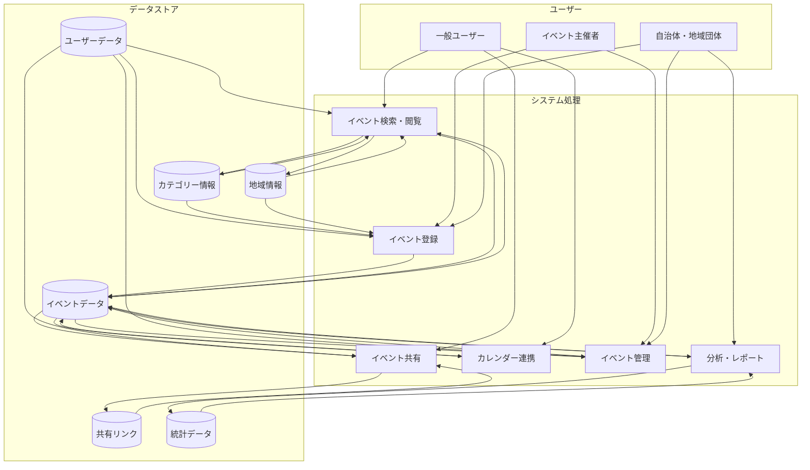
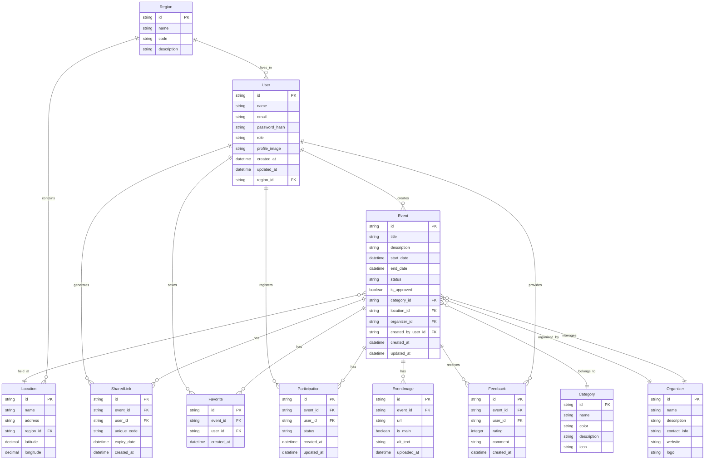

# ローカルイベントカレンダー データモデル設計

## 1. システム処理フローとデータフロー



## 2. データモデル（ERD）



## 3. 統合されたデータモデル設計

### User（ユーザー）
**テーブル責務**: ユーザーアカウント情報の管理とユーザー認証の提供

| フィールド名 | 型 | 必須 | 説明 |
|------------|-----|------|------|
| id | String | ✓ | ユーザーID（主キー） |
| name | String | ✓ | ユーザー名 |
| email | String | ✓ | メールアドレス（一意） |
| password_hash | String | ✓ | パスワードハッシュ |
| role | String | ✓ | 権限（一般ユーザー/イベント主催者/管理者） |
| profile_image | String |  | プロフィール画像URL |
| region_id | String | ✓ | 所属地域ID（外部キー） |
| created_at | DateTime | ✓ | 作成日時 |
| updated_at | DateTime | ✓ | 更新日時 |

### Event（イベント）
**テーブル責務**: イベント情報の中核となるデータの管理

| フィールド名 | 型 | 必須 | 説明 |
|------------|-----|------|------|
| id | String | ✓ | イベントID（主キー） |
| title | String | ✓ | イベント名 |
| description | String |  | イベント詳細説明 |
| start_date | DateTime | ✓ | 開始日時 |
| end_date | DateTime | ✓ | 終了日時 |
| status | String | ✓ | ステータス（計画中/公開中/終了済み/中止） |
| is_approved | Boolean | ✓ | 承認ステータス |
| category_id | String | ✓ | カテゴリーID（外部キー） |
| location_id | String | ✓ | 開催場所ID（外部キー） |
| organizer_id | String | ✓ | 主催者ID（外部キー） |
| created_by_user_id | String | ✓ | 作成ユーザーID（外部キー） |
| created_at | DateTime | ✓ | 作成日時 |
| updated_at | DateTime | ✓ | 更新日時 |

### Category（カテゴリー）
**テーブル責務**: イベントの分類情報の管理

| フィールド名 | 型 | 必須 | 説明 |
|------------|-----|------|------|
| id | String | ✓ | カテゴリーID（主キー） |
| name | String | ✓ | カテゴリー名 |
| color | String | ✓ | 表示色（HEXコード） |
| description | String |  | カテゴリー説明 |
| icon | String |  | アイコン名またはURL |

### Location（開催場所）
**テーブル責務**: イベント開催場所情報の管理

| フィールド名 | 型 | 必須 | 説明 |
|------------|-----|------|------|
| id | String | ✓ | 場所ID（主キー） |
| name | String | ✓ | 場所名 |
| address | String | ✓ | 住所 |
| region_id | String | ✓ | 地域ID（外部キー） |
| latitude | Decimal |  | 緯度 |
| longitude | Decimal |  | 経度 |

### Organizer（主催者）
**テーブル責務**: イベント主催団体の情報管理

| フィールド名 | 型 | 必須 | 説明 |
|------------|-----|------|------|
| id | String | ✓ | 主催者ID（主キー） |
| name | String | ✓ | 主催者名 |
| description | String |  | 主催者詳細説明 |
| contact_info | String |  | 連絡先情報 |
| website | String |  | ウェブサイトURL |
| logo | String |  | ロゴURL |

### SharedLink（共有リンク）
**テーブル責務**: イベント共有用の一意なリンク管理

| フィールド名 | 型 | 必須 | 説明 |
|------------|-----|------|------|
| id | String | ✓ | 共有リンクID（主キー） |
| event_id | String | ✓ | イベントID（外部キー） |
| user_id | String | ✓ | 作成ユーザーID（外部キー） |
| unique_code | String | ✓ | 一意の共有コード |
| expiry_date | DateTime |  | 有効期限 |
| created_at | DateTime | ✓ | 作成日時 |

### Favorite（お気に入り）
**テーブル責務**: ユーザーのイベントお気に入り情報の管理

| フィールド名 | 型 | 必須 | 説明 |
|------------|-----|------|------|
| id | String | ✓ | お気に入りID（主キー） |
| event_id | String | ✓ | イベントID（外部キー） |
| user_id | String | ✓ | ユーザーID（外部キー） |
| created_at | DateTime | ✓ | 作成日時 |

### Participation（参加登録）
**テーブル責務**: ユーザーのイベント参加情報の管理

| フィールド名 | 型 | 必須 | 説明 |
|------------|-----|------|------|
| id | String | ✓ | 参加ID（主キー） |
| event_id | String | ✓ | イベントID（外部キー） |
| user_id | String | ✓ | ユーザーID（外部キー） |
| status | String | ✓ | 参加ステータス（予定/確定/キャンセル） |
| created_at | DateTime | ✓ | 作成日時 |
| updated_at | DateTime | ✓ | 更新日時 |

### EventImage（イベント画像）
**テーブル責務**: イベント関連画像の管理

| フィールド名 | 型 | 必須 | 説明 |
|------------|-----|------|------|
| id | String | ✓ | 画像ID（主キー） |
| event_id | String | ✓ | イベントID（外部キー） |
| url | String | ✓ | 画像URL |
| is_main | Boolean | ✓ | メイン画像フラグ |
| alt_text | String |  | 代替テキスト |
| uploaded_at | DateTime | ✓ | アップロード日時 |

### Feedback（フィードバック）
**テーブル責務**: イベントへのフィードバック情報の管理

| フィールド名 | 型 | 必須 | 説明 |
|------------|-----|------|------|
| id | String | ✓ | フィードバックID（主キー） |
| event_id | String | ✓ | イベントID（外部キー） |
| user_id | String | ✓ | ユーザーID（外部キー） |
| rating | Integer | ✓ | 評価（1-5） |
| comment | String |  | コメント |
| created_at | DateTime | ✓ | 作成日時 |

### Region（地域）
**テーブル責務**: 地域情報の管理

| フィールド名 | 型 | 必須 | 説明 |
|------------|-----|------|------|
| id | String | ✓ | 地域ID（主キー） |
| name | String | ✓ | 地域名 |
| code | String | ✓ | 地域コード |
| description | String |  | 地域説明 |

## 4. データモデルの技術的実装（Prisma Schema）

```prisma
// Prismaスキーマ定義

generator client {
  provider = "prisma-client-js"
}

datasource db {
  provider = "postgresql"
  url      = env("DATABASE_URL")
}

// ユーザー管理
model User {
  id            String         @id @default(uuid())
  name          String
  email         String         @unique
  password_hash String
  role          String         @default("USER") // USER, ORGANIZER, ADMIN
  profile_image String?
  region_id     String
  created_at    DateTime       @default(now())
  updated_at    DateTime       @updatedAt
  
  // リレーション
  region         Region          @relation(fields: [region_id], references: [id])
  events         Event[]         @relation("CreatedByUser")
  favorites      Favorite[]
  participations Participation[]
  shared_links   SharedLink[]
  feedbacks      Feedback[]

  @@map("users")
}

// イベント情報
model Event {
  id                String   @id @default(uuid())
  title             String
  description       String?
  start_date        DateTime
  end_date          DateTime
  status            String   @default("PUBLISHED") // PLANNED, PUBLISHED, ENDED, CANCELLED
  is_approved       Boolean  @default(true)
  category_id       String
  location_id       String
  organizer_id      String
  created_by_user_id String
  created_at        DateTime @default(now())
  updated_at        DateTime @updatedAt
  
  // リレーション
  category       Category        @relation(fields: [category_id], references: [id])
  location       Location        @relation(fields: [location_id], references: [id])
  organizer      Organizer       @relation(fields: [organizer_id], references: [id])
  created_by     User            @relation("CreatedByUser", fields: [created_by_user_id], references: [id])
  images         EventImage[]
  favorites      Favorite[]
  participations Participation[]
  shared_links   SharedLink[]
  feedbacks      Feedback[]

  @@map("events")
}

// カテゴリー
model Category {
  id          String  @id @default(uuid())
  name        String  @unique
  color       String
  description String?
  icon        String?
  
  // リレーション
  events      Event[]

  @@map("categories")
}

// 開催場所
model Location {
  id         String  @id @default(uuid())
  name       String
  address    String
  region_id  String
  latitude   Decimal?
  longitude  Decimal?
  
  // リレーション
  region     Region   @relation(fields: [region_id], references: [id])
  events     Event[]

  @@map("locations")
}

// 主催者
model Organizer {
  id           String  @id @default(uuid())
  name         String
  description  String?
  contact_info String?
  website      String?
  logo         String?
  
  // リレーション
  events       Event[]

  @@map("organizers")
}

// 共有リンク
model SharedLink {
  id          String    @id @default(uuid())
  event_id    String
  user_id     String
  unique_code String    @unique
  expiry_date DateTime?
  created_at  DateTime  @default(now())
  
  // リレーション
  event       Event     @relation(fields: [event_id], references: [id])
  user        User      @relation(fields: [user_id], references: [id])

  @@map("shared_links")
}

// お気に入り
model Favorite {
  id         String   @id @default(uuid())
  event_id   String
  user_id    String
  created_at DateTime @default(now())
  
  // リレーション
  event      Event    @relation(fields: [event_id], references: [id])
  user       User     @relation(fields: [user_id], references: [id])

  @@unique([event_id, user_id])
  @@map("favorites")
}

// 参加登録
model Participation {
  id         String   @id @default(uuid())
  event_id   String
  user_id    String
  status     String   @default("PLANNED") // PLANNED, CONFIRMED, CANCELLED
  created_at DateTime @default(now())
  updated_at DateTime @updatedAt
  
  // リレーション
  event      Event    @relation(fields: [event_id], references: [id])
  user       User     @relation(fields: [user_id], references: [id])

  @@unique([event_id, user_id])
  @@map("participations")
}

// イベント画像
model EventImage {
  id          String   @id @default(uuid())
  event_id    String
  url         String
  is_main     Boolean  @default(false)
  alt_text    String?
  uploaded_at DateTime @default(now())
  
  // リレーション
  event       Event    @relation(fields: [event_id], references: [id])

  @@map("event_images")
}

// フィードバック
model Feedback {
  id         String   @id @default(uuid())
  event_id   String
  user_id    String
  rating     Int
  comment    String?
  created_at DateTime @default(now())
  
  // リレーション
  event      Event    @relation(fields: [event_id], references: [id])
  user       User     @relation(fields: [user_id], references: [id])

  @@unique([event_id, user_id])
  @@map("feedbacks")
}

// 地域
model Region {
  id          String     @id @default(uuid())
  name        String
  code        String     @unique
  description String?
  
  // リレーション
  users       User[]
  locations   Location[]

  @@map("regions")
}
```

## 5. 考慮事項とデザインノート

### データモデル設計の考慮事項

1. **スケーラビリティ**
   - UUID形式のIDを使用し、将来的なデータ量増加に対応
   - 複数の地域に対応できるRegionモデルの実装

2. **パフォーマンス**
   - 頻繁に参照されるリレーションには適切なインデックスを追加予定
   - 大量のイベントデータの検索に対応するため、効率的なクエリ設計を考慮

3. **拡張性**
   - 将来的な機能追加（繰り返しイベント、チケット販売など）に対応できる設計
   - 自治体との連携のためのAPIインターフェースを想定

4. **セキュリティ**
   - パスワードはハッシュ化して保存
   - イベント承認システムによる不適切なコンテンツの排除

### 現在の設計と既存コードの統合

既存のコードでは単純なEventインターフェースが使用されていますが、今回の設計ではより包括的なデータモデルを提案しています。移行時には以下の点に注意が必要です：

1. 既存のmock-dataからの実データへの移行プロセスの設計
2. コンポーネント（event-form.tsx等）の更新による新しいデータモデルの活用
3. Google Calendarとの連携機能を考慮したデータ構造の整合性確保

## 6. 今後の検討事項

1. **プレミアム機能の実装**
   - 有料ユーザー向け機能をサポートするデータモデルの拡張
   - 決済情報の管理方法

2. **イベント通知システム**
   - 通知設定や配信履歴を管理するモデルの追加検討

3. **アクセス制御の詳細設計**
   - 複数の権限レベルに対応する詳細なアクセス制御の実装

4. **多言語対応**
   - 将来的な多言語対応のためのデータモデル拡張の検討

5. **レポート・分析機能の強化**
   - 詳細な分析データを蓄積するためのデータ構造の検討 