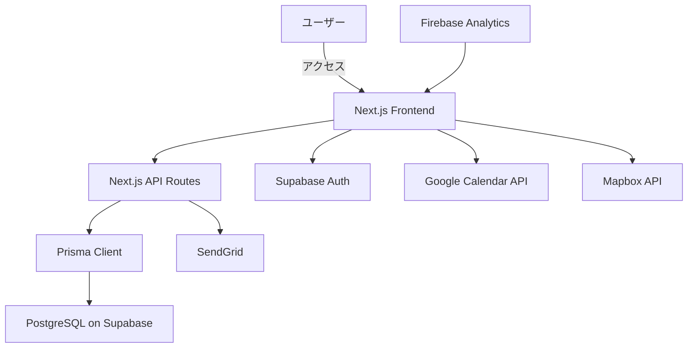

# 要件定義書

## 1. プロジェクト概要

### 1.1 プロジェクト名

**「シティイベントカレンダー開発プロジェクト」**

### 1.2 背景・目的

**背景**: 
現在、地域イベント情報は紙のチラシ、掲示板、複数のSNSなど様々な媒体に分散しており、住民が地域の活動情報を網羅的に把握することが困難になっています。特に高齢者や新しい住民は地域情報へのアクセスが制限されがちで、地域の魅力を十分に享受できていない状況です。また、イベント主催者側も情報発信手段が限定的で、集客や参加者とのコミュニケーションに苦心しています。地域コミュニティの希薄化が進む中、こうした情報の分断は地域活動への参加機会の損失につながっています。

**目的**: 
- 地域イベント情報を一元管理し、住民の情報アクセス性を向上させることで、イベント参加率を初年度で30%向上させる
- 多世代にわたる地域住民の交流を促進し、コミュニティの活性化に貢献する
- イベント主催者の情報発信効率を高め、集客数を平均20%増加させる
- 高齢者のデジタルデバイド解消に貢献し、デジタルツール活用率を向上させる

### 1.3 システムのビジョン / スコープ

**ビジョン**: 
「シティイベントカレンダー」は、地域のあらゆるイベント情報をカレンダー形式で視覚的に提供し、誰もが簡単に地域活動に参加できる環境を実現します。世代を問わず使いやすいシンプルなUIと共有機能により、地域コミュニティの絆を深め、「地域の公共インフラ」として定着することを目指します。

**スコープ**: 
- **含まれる範囲**:
  - モバイルレスポンシブ対応のWebアプリケーション
  - カレンダー形式での地域イベント情報表示機能
  - イベント登録・管理機能
  - 検索・フィルタリング機能
  - イベント共有・通知機能
  - Google Calendarとの連携
  - 1地域でのパイロット運用

- **含まれない範囲**:
  - ネイティブスマートフォンアプリ（将来フェーズでの対応を想定）
  - チケット予約・決済機能（将来フェーズでの実装を検討）
  - 他の外部カレンダーとの連携（Google Calendar以外）
  - 多言語対応（初期フェーズでは日本語のみ）

---

## 2. ビジネス要件

### 2.1 ビジネスモデル情報

**リーンキャンバスのまとめ**:
- **解決する課題**: 地域イベント情報の分散による情報の取得困難、イベント情報の網羅性不足と見落とし、イベント主催者側の限定的な情報発信手段
- **価値提案**: 地域イベントの一元管理と視覚化による発見体験の提供、イベントの共有機能とGoogle Calendarへのワンクリック追加機能、カテゴリー別の区分けと検索機能
- **収益構造**: 
  - スポンサードイベント掲載料（地域企業・団体から）：35%
  - 自治体との連携による公共サービス委託料：30%
  - プレミアム機能のサブスクリプション（月額/年額）：20%
  - 大規模イベント主催者向け拡張機能利用料：10%
  - データ分析レポート提供：5%

**7Powers視点での優位性**:
- **規模の経済**: 地域イベント情報のデータベース構築と維持に初期投資が必要だが、複数地域に展開することで共通プラットフォーム基盤を再利用できる
- **ネットワーク効果**: 地域住民のユーザー数が増えるほど、イベント主催者にとって告知効果が高まり、より多くのイベント情報が登録される好循環
- **カウンターポジショニング**: 「地域特化型」「イベント特化型」という明確なポジショニングと、高齢者を含む多世代が使いやすいUIは大手プラットフォームが追随しにくい
- **スイッチングコスト**: ユーザーの「お気に入りイベント」「参加履歴」「共有リンク」などの蓄積データと自治体や地域団体との連携
- **ブランド力**: 「地域コミュニティの絆を深める信頼できるプラットフォーム」というブランドイメージ構築
- **囲い込みリソース**: 地域イベントの構造化データベースと自治体・地域団体との連携による公式イベント情報の優先的提供権
- **プロセス力**: イベント情報の効率的な収集・検証・構造化プロセスと地域特性に応じたカスタマイズプロセスの標準化

**市場規模/成長予測** (仮定):
- 初期対象ユーザー：中規模都市（人口10万人程度）の住民
- 1年目末：月間アクティブユーザー5,000人（対象地域人口の5%）
- 3年目末：20地域展開、月間アクティブユーザー10万人
- 5年目末：100地域展開、月間アクティブユーザー50万人

### 2.2 成果指標（KPI/KGI）

**KGI（重要目標達成指標）**:
- 1年目末：3地域展開、累計登録ユーザー1万人
- 2年目末：10地域展開、累計登録ユーザー5万人、収益1,000万円/年
- 3年目末：20地域展開、累計登録ユーザー10万人、収益3,000万円/年

**KPI（重要業績評価指標）**:
- **ユーザー関連**:
  - 月間アクティブユーザー（MAU）増加率：月20%（初年度）
  - ユーザー継続率：初月後70%以上
  - 平均セッション時間：3分以上
  - 一人あたりの月間アクセス回数：8回以上

- **コンテンツ関連**:
  - 登録イベント数：地域あたり月間100件以上
  - イベント情報の網羅性：地域内公共イベントの90%以上をカバー
  - イベント詳細の充実度：80%以上のイベントで画像・詳細説明あり

- **エンゲージメント関連**:
  - イベント共有機能利用率：月間アクティブユーザーの30%以上
  - Google Calendarへの追加率：閲覧イベントの15%以上
  - 新規ユーザーの友人紹介率：20%以上

### 2.3 ビジネス上の制約

**予算・開発期間・リソース面での制約** (仮定):
- 初期開発予算：2,000万円
- MVP開発期間：3ヶ月
- 開発チーム：エンジニア3名、デザイナー1名、PM1名

**法的要件・規制**:
- 個人情報保護法に準拠したユーザーデータの取り扱い
- 各地域の条例・規制に対応したローカライズ対応
- 著作権・肖像権に配慮したイベント情報・画像の管理
- アクセシビリティ対応（WCAG 2.1 AAレベル準拠）

---

## 3. ユーザー要件

### 3.1 ユーザープロファイル / ペルソナ

**ペルソナ1: 地域活動に関心のある40代女性**
- 名前：田中由美（42歳）
- 職業：パート勤務（週3日）
- 家族構成：夫、中学生の息子、小学生の娘
- 特徴：
  - 子どもの学校行事や地域の文化活動に積極的に参加したい
  - スマートフォンは日常的に使うが、複雑な操作は苦手
  - 家族の予定調整に苦労している
  - 地域の情報を主に学校の配布物や掲示板で入手している
- 課題：
  - イベント情報が分散していて見逃しがち
  - 家族との予定共有が煩雑
  - 子ども向けの地域イベントをもっと知りたい

**ペルソナ2: 地域イベント主催者の60代男性**
- 名前：佐藤健一（65歳）
- 職業：退職後、地域文化団体の代表
- 特徴：
  - 月1回の地域文化イベントを主催している
  - パソコンは使えるが、デジタルツールには不慣れ
  - イベントの告知は主にチラシと口コミに頼っている
  - 参加者を増やしたいが効果的な宣伝方法に悩んでいる
- 課題：
  - デジタルツールを活用した効率的な情報発信方法
  - 若年層へのリーチ拡大
  - イベント参加者との継続的なコミュニケーション

**ペルソナ3: 新しく地域に引っ越してきた30代男性**
- 名前：山田太郎（34歳）
- 職業：IT企業勤務（リモートワーク中心）
- 特徴：
  - 転勤で6ヶ月前に引っ越してきたばかり
  - 地域に知り合いがほとんどいない
  - デジタルツールの活用に慣れている
  - 地域コミュニティに参加したいが、きっかけがない
- 課題：
  - 地域の情報源がわからない
  - 興味のある地域活動を見つけるのが難しい
  - 同じ趣味を持つ地域住民との交流機会

### 3.2 ユーザーストーリー

1. **地域住民として、様々なカテゴリーの地域イベントを一覧で見つけたい。なぜなら、今まで知らなかった地域活動に参加する機会を得られるからだ。**

2. **イベント参加者として、興味のあるイベントを家族や友人と簡単に共有したい。なぜなら、一緒に参加する約束を効率的に調整できるからだ。**

3. **イベント主催者として、企画したイベントを効果的に告知し、参加者の反応を把握したい。なぜなら、より多くの人に参加してもらい、今後の企画改善に活かせるからだ。**

4. **高齢者として、簡単な操作で地域の催し物を確認したい。なぜなら、デジタルツールに不慣れでも地域の活動に参加する機会を逃したくないからだ。**

5. **自治体職員として、地域の公共イベント情報を効率的に発信したい。なぜなら、より多くの住民に行政サービスを知ってもらい、参加を促進したいからだ。**

### 3.3 MVP（Minimum Viable Product）の定義

**MVPで実装する範囲**:
- 基本的なカレンダー表示機能（月・週・日表示）
- カテゴリー別（地域イベント、文化、健康、教育）の色分け表示
- イベントの基本情報登録・閲覧機能
- シンプルな検索・フィルタリング機能
- 基本的なイベント共有機能（URLコピー）
- モバイルレスポンシブ対応のWebアプリケーション
- 1地域（パイロット地域）でのリリース

**MVPのゴール**:
- 実ユーザーからの早期フィードバック獲得
- 主要機能の有用性検証
- コアユーザー（地域住民、イベント主催者）の利用パターン把握
- 地域パートナー（自治体、地域団体）との連携モデル検証
- 次フェーズ開発の優先順位付け 

---

## 4. 機能要件

### 4.1 機能一覧 / MoSCoW 分類

| 機能 ID | 機能名                         | 要約                                                   | Must/Should/Could/Won't | MVP 対象 |
| ------- | ------------------------------ | ------------------------------------------------------ | ----------------------- | -------- |
| F-001   | カレンダー表示機能             | イベントを月・週・日表示のカレンダー形式で表示         | Must                    | Yes      |
| F-002   | カテゴリー別表示機能           | イベントをカテゴリー別に色分けして表示                 | Must                    | Yes      |
| F-003   | イベント詳細表示機能           | イベントの詳細情報を閲覧できる                         | Must                    | Yes      |
| F-004   | イベント登録・編集機能         | イベント情報の登録・編集を行う                         | Must                    | Yes      |
| F-005   | イベント検索機能               | キーワードによるイベント検索                           | Must                    | Yes      |
| F-006   | イベントフィルタリング機能     | カテゴリー/日付/場所/主催者別のフィルタリング         | Must                    | Yes      |
| F-007   | イベント共有機能               | イベント詳細の共有用リンク生成                         | Must                    | Yes      |
| F-008   | Google Calendar連携機能        | イベントをGoogle Calendarに追加                        | Should                  | No       |
| F-009   | ユーザー登録・認証機能         | メールアドレスによるユーザー登録と認証                 | Should                  | Yes      |
| F-010   | ユーザープロフィール設定       | 興味のあるカテゴリーや地域設定などの管理               | Should                  | No       |
| F-011   | イベント参加予定登録           | イベントへの参加意思表示と管理                         | Should                  | No       |
| F-012   | イベント画像アップロード       | イベントポスターなどの画像登録                         | Should                  | Yes      |
| F-013   | イベント場所マップ表示         | イベント開催場所の地図表示                             | Should                  | No       |
| F-014   | お気に入りイベント機能         | イベントをお気に入りとして保存                         | Should                  | No       |
| F-015   | 主催者ダッシュボード           | イベント主催者向け管理画面                             | Should                  | No       |
| F-016   | カレンダーエクスポート機能     | カレンダーデータのPDF/印刷出力                         | Could                   | No       |
| F-017   | イベント通知機能               | イベント更新・リマインダー通知                         | Could                   | No       |
| F-018   | SNS連携共有機能                | SNSへの直接共有機能                                   | Could                   | No       |
| F-019   | イベント参加状況分析           | 過去イベントの参加状況分析                             | Could                   | No       |
| F-020   | イベントフィードバック機能     | イベント参加後のフィードバック投稿                     | Could                   | No       |
| F-021   | 管理者承認ワークフロー         | イベント投稿の管理者承認プロセス                       | Could                   | No       |
| F-022   | データ分析レポート機能         | 地域イベントデータの分析レポート                       | Won't                   | No       |
| F-023   | 参加者向けアンケート機能       | イベント参加者向けアンケート作成・収集                 | Won't                   | No       |

### 4.2 機能詳細仕様

#### 4.2.1 `<機能ID: F-001 カレンダー表示機能>`

- **概要**: イベント情報をカレンダー形式（月・週・日表示）で視覚的に表示する機能
- **ユースケース**: 「ユーザーが地域のイベント情報を一覧で確認する」
- **前提条件**: Webアプリケーションにアクセスできる環境がある
- **正常系フロー**:
  1. ユーザーがアプリにアクセス
  2. デフォルトで当月のカレンダー（月表示）が表示される
  3. 日付マスにその日開催されるイベントがサムネイル表示される
  4. 表示切替ボタンで月表示/週表示/日表示を切り替え可能
  5. 前月/翌月、前週/翌週などのナビゲーションで日付範囲を移動可能
- **例外系フロー**:
  - イベントがない日付はイベント無しと表示
  - データ読み込みに失敗した場合はエラーメッセージを表示し再試行ボタンを表示
- **UI要件**:
  - 月表示：標準的なカレンダーグリッド形式
  - 週表示：横軸に曜日、縦軸に時間を配置
  - 日表示：選択日の時間軸に沿ったイベント表示
  - カテゴリー別の色分け表示（地域イベント：赤、文化：青、健康：黄、教育：緑）
- **非機能面注意**:
  - 表示速度：初期表示は2秒以内
  - 日付切り替え時のレスポンス：1秒以内
  - 様々な画面サイズ（PC、タブレット、スマートフォン）に対応したレスポンシブデザイン

#### 4.2.2 `<機能ID: F-004 イベント登録・編集機能>`

- **概要**: イベント主催者やユーザーが新規イベント情報を登録・編集できる機能
- **ユースケース**: 「イベント主催者が新しいイベントを登録する」、「登録済みのイベント情報を更新する」
- **前提条件**: ユーザーアカウントでログインしている（MVP段階では簡易認証も可）
- **正常系フロー**:
  1. 「イベント登録」ボタンをクリック
  2. イベント登録フォームが表示される
  3. 必須項目（イベント名、開催日時、場所、カテゴリー）と任意項目（説明、画像、連絡先等）を入力
  4. 「プレビュー」ボタンでイベント表示確認が可能
  5. 「保存」ボタンで登録完了、または「下書き保存」で一時保存
  6. 登録完了後、イベント詳細画面に遷移
- **例外系フロー**:
  - 必須項目が未入力の場合、エラーメッセージを表示
  - 日付形式が不正な場合、適切なエラーガイダンスを表示
  - 通信エラー時には入力内容を保持し、再試行機能を提供
- **UI要件**:
  - 直感的でシンプルなフォームデザイン
  - 入力項目は論理的なグループに分類
  - 日時選択にはカレンダーピッカーを使用
  - 繰り返しイベントの設定オプション（週次、月次など）
  - 画像アップロードはドラッグ&ドロップも対応
- **非機能面注意**:
  - フォーム送信のレスポンス：3秒以内
  - 画像アップロードサイズ制限：1枚あたり5MB以下
  - CSRF対策の実装
  - 入力データのバリデーション（XSS対策含む）

#### 4.2.3 `<機能ID: F-007 イベント共有機能>`

- **概要**: イベント情報を友人や家族と共有するためのリンク生成・共有機能
- **ユースケース**: 「ユーザーが興味を持ったイベントを家族に共有する」
- **前提条件**: イベント詳細画面を閲覧している
- **正常系フロー**:
  1. イベント詳細画面で「共有」ボタンをクリック
  2. 共有方法の選択肢が表示（リンクコピー、メール、LINEなど）
  3. 選択した方法でイベント情報（タイトル、日時、場所、URLなど）を共有
  4. 共有完了メッセージの表示
- **例外系フロー**:
  - クリップボードへのコピーが失敗した場合、手動でコピーするよう促すメッセージ表示
  - メール共有時にメールアプリが設定されていない場合の代替手段を提示
- **UI要件**:
  - シンプルで目立つ共有ボタン
  - よく使われる共有方法をアイコンで分かりやすく表示
  - 共有プレビューの表示（共有される内容確認）
- **非機能面注意**:
  - 共有リンクの有効期限設定（任意）
  - 共有リンクへのアクセス統計の取得（クリック数など）
  - データ保護（共有時に機密情報が含まれないよう配慮）

#### 4.2.4 `<機能ID: F-009 ユーザー登録・認証機能>`

- **概要**: ユーザーがメールアドレスを用いて登録・認証を行う機能
- **ユースケース**: 「新規ユーザーが登録する」、「既存ユーザーがログインする」
- **前提条件**: 認証システム（Supabase Auth等）が導入されている
- **正常系フロー**:
  1. 「登録/ログイン」ボタンをクリック
  2. メールアドレス入力フォームが表示される
  3. メールアドレスを入力して「送信」ボタンをクリック
  4. 入力したメールアドレスに認証リンクが送信される
  5. ユーザーがメール内の認証リンクをクリックすると自動的にログイン完了
- **例外系フロー**:
  - 無効なメールアドレス形式の場合、エラーメッセージを表示
  - 認証メールが届かない場合の再送信機能
  - 認証リンクの有効期限切れ時の対応
- **UI要件**:
  - シンプルな登録フォーム
  - ログイン状態の明示（ヘッダー部分など）
  - 認証プロセスの進行状況表示
- **非機能面注意**:
  - セキュリティ（HTTPS通信、認証トークン管理）
  - 個人情報保護への配慮
  - アカウント乗っ取り対策 

---

## 5. 非機能要件

### 5.1 パフォーマンス要件

- **レスポンス時間**:
  - ページ初期読み込み時間：3秒以内（モバイル回線環境下）
  - ユーザーアクション（クリック、入力など）に対するレスポンス：1秒以内
  - API応答時間：500ms以内
  - 画像表示：最適化済み画像の使用で1秒以内の表示

- **同時接続数**:
  - 通常時：500ユーザー同時アクセスに対応
  - ピーク時（地域イベント開催時など）：最大3,000ユーザー同時アクセスに対応

- **処理量**:
  - 初期フェーズ：月間10万PV程度
  - 1地域あたりの月間イベント登録数：100〜500件
  - イベント検索処理：1秒あたり最大20リクエスト

### 5.2 セキュリティ要件

- **認証/認可**:
  - Supabase Authによるユーザー認証
  - JWTトークンベースの認証管理
  - 権限レベル（一般ユーザー、イベント主催者、管理者）に基づくアクセス制御

- **データ保護**:
  - HTTPS通信の強制（SSL/TLS）
  - ユーザー個人情報の暗号化保存
  - パスワードレス認証の採用（メールリンク認証）

- **監査ログ**:
  - 管理者操作ログの記録
  - ユーザーによるイベント登録・編集履歴の保持
  - 不正アクセス検知と記録

- **コンプライアンス**:
  - 個人情報保護法に準拠したプライバシーポリシーの実装
  - アクセシビリティ対応（WCAG 2.1 AAレベル準拠）
  - クッキーポリシーの明示

### 5.3 可用性・信頼性

- **稼働率**:
  - サービス稼働率：99.5%以上（月間4時間以内のダウンタイム許容）
  - 計画的メンテナンス時間：月1回、深夜2時間以内

- **障害時の復旧手順/DR対応**:
  - バックアップ：日次自動バックアップ、7日分保持
  - 障害復旧目標：RTO（目標復旧時間）4時間以内、RPO（目標復旧時点）24時間以内
  - インシデント発生時の自動通知システム

- **フェイルオーバー**:
  - クラウドプロバイダのリージョン冗長性活用
  - 静的コンテンツのCDN配信によるバックエンド障害時の基本機能維持

### 5.4 ユーザビリティ / UI・UX

- **アクセシビリティ**:
  - 色のコントラスト比確保（WCAG AAレベル以上）
  - スクリーンリーダー対応
  - キーボードナビゲーション対応
  - 文字サイズ変更機能

- **多言語対応の有無**:
  - 初期フェーズでは日本語のみ対応
  - 将来的に英語対応を検討（地域の外国人居住者向け）

- **操作導線**:
  - 初めてのユーザーでも直感的に操作できるシンプルなUI
  - 主要機能へのアクセスは3クリック以内
  - 高齢者にも分かりやすい大きめのボタンと明確なラベル
  - エラー時の分かりやすいガイダンス表示

### 5.5 スケーラビリティ

- **水平/垂直スケーリング**:
  - Vercel/Supabaseのオートスケーリング機能活用
  - 地域ごとのデータパーティショニング設計

- **突発的アクセス増対策**:
  - キャッシュ戦略（CDN、Stale-While-Revalidate）
  - 静的ページ生成（SSG）と増分静的再生成（ISR）の活用
  - 重要コンポーネントのコンテンツ配信の優先順位付け

---

## 6. インテグレーション要件

### 6.1 外部サービス / SaaS 連携

- **認証系**:
  - Supabase Auth：ユーザー認証機能
  - （オプション）Google/Apple/LINEのソーシャルログイン

- **データベース系**:
  - Supabase（PostgreSQL）：主要データベース
  - Supabase Storage：イベント画像保存

- **地図系**:
  - Mapbox API：イベント開催場所の地図表示

- **カレンダー系**:
  - Google Calendar API：イベントのGoogleカレンダーへの追加・同期

- **通知系**:
  - SendGrid：メール通知
  - （将来）Firebase Cloud Messaging：プッシュ通知

- **分析系**:
  - Firebase Analytics：ユーザー行動分析
  - Supabase Analytics：データベース利用状況分析

### 6.2 API 仕様

- **提供・利用API**:
  - REST API（バックエンド⇔フロントエンド間）
  - Google Calendar API（外部連携）

- **エンドポイント例**:
  - `GET /api/events`: イベント一覧取得
  - `GET /api/events/{id}`: 特定イベント詳細取得
  - `POST /api/events`: 新規イベント登録
  - `PUT /api/events/{id}`: イベント情報更新
  - `GET /api/events/search?q={keyword}`: イベント検索
  - `GET /api/categories`: カテゴリー一覧取得
  - `POST /api/events/{id}/share`: 共有リンク生成
  - `POST /api/calendar/sync`: Google Calendar同期

- **HTTP メソッド**: GET, POST, PUT, DELETE
- **データフォーマット**: JSON
- **認証方式**: JWTトークン

### 6.3 データ連携要件

- **データ形式**:
  - アプリケーション内：JSON
  - カレンダー連携：iCalendar（.ics）フォーマット
  - エクスポート：CSV, PDF

- **頻度**:
  - リアルタイム：ユーザーアクション（登録・更新・削除）時
  - 定期バッチ：日次イベント通知、週次レポート生成（将来機能）

- **再送制御**:
  - API連携失敗時の自動リトライ（指数バックオフ方式）
  - 一時的な接続不良時のオフラインモード対応（PWA機能）
  - 同期状態の表示とユーザー主導の再同期オプション 

---

## 7. 技術選定とアーキテクチャ

### 7.1 技術スタックの要約

- **フロントエンド**:
  - Next.js: SSRによる高速表示、SEO対応、React Server Componentsによるパフォーマンス最適化
  - TypeScript: 型安全性の確保、コード品質向上
  - Tailwind CSS: レスポンシブデザインの効率的実装、カスタマイズ性
  - Shadcn UI / Radix UI: アクセシビリティに配慮したUIコンポーネント
  - React Query: データフェッチングの効率化、キャッシュ管理

- **バックエンド**:
  - Node.js: 開発効率の高さ、エコシステムの充実
  - Express.js: 軽量で柔軟なAPIサーバー構築
  - Prisma: 型安全なデータベースアクセス、マイグレーション管理の容易さ

- **データベース**:
  - PostgreSQL: 構造化データの信頼性の高い管理、オープンソース
  - Supabase: PostgreSQLホスティング、認証機能、ストレージ

- **ホスティング/デプロイ**:
  - Vercel: Next.jsとの親和性、CI/CD自動化、エッジデプロイメント
  - GitHub / GitHub Actions: バージョン管理、CI/CD自動化

- **外部サービス統合**:
  - Google Calendar API: カレンダー連携
  - Mapbox API: 地図表示機能
  - SendGrid: メール通知
  - Firebase Analytics: ユーザー行動分析

### 7.2 アーキテクチャ概要

- **UI層**:
  - Next.js / React: ユーザーインターフェースとクライアントサイドの機能
  - Server Components: サーバーサイドでのレンダリングと最適化
  - Client Components: インタラクティブな機能（イベント登録、共有など）

- **API層**:
  - Next.js API Routes: RESTful APIエンドポイント
  - Prisma Client: データベースアクセス

- **DB層**:
  - PostgreSQL: リレーショナルデータベース（Supabaseホスティング）
  - Prisma Schema: データモデル定義と移行管理

- **外部連携**:
  - API Wrappers: 外部サービス（Google Calendar, Mapbox等）とのインテグレーション
  - Supabase Auth: 認証・認可サービス

### 7.3 システム構成図

## 8. 開発プロセス / スケジュール

### 8.1 開発モデル・プロセス

- **アジャイル開発モデル**:
  - 2週間単位のスプリント
  - スプリント計画・レビュー・振り返りの定例ミーティング
  - 機能ごとのユーザーストーリーとタスク分解

- **MVP主導アプローチ**:
  - 早期のMVPリリースによるユーザーフィードバック収集
  - フィードバックに基づく機能の優先順位付けと改善
  - 地域ごとの段階的展開と検証

- **継続的インテグレーション/デリバリー**:
  - GitHub Flow（feature branchワークフロー）
  - プルリクエストとコードレビュー
  - 自動テストとデプロイパイプライン

### 8.2 スケジュール

| フェーズ                    | 期間         | 主なタスク                                            |
|-----------------------------|--------------|-------------------------------------------------------|
| 要件定義・設計              | 1ヶ月目      | 詳細要件確定、UI/UXデザイン、データモデル設計         |
| フェーズ1: MVP開発          | 2〜4ヶ月目   | 基本的なカレンダー表示機能、イベント登録・管理機能、検索・フィルタリング機能、初期UI/UX実装 |
| パイロット運用・評価        | 4〜5ヶ月目   | 1地域でのパイロット運用、フィードバック収集、改善点特定 |
| フェーズ2: 基本機能強化     | 5〜7ヶ月目   | Google Calendar連携、共有機能強化、ユーザー登録機能拡充、3地域への展開 |
| フェーズ3: 主催者機能強化   | 7〜9ヶ月目   | 主催者向けダッシュボード、分析機能、自治体連携機能、5地域への展開 |
| フェーズ4: エンゲージメント | 9〜11ヶ月目  | 通知機能、パーソナライズ機能、コミュニティ機能、10地域への展開 |
| フェーズ5: 最適化・拡張     | 11〜13ヶ月目 | データ分析レポート機能、パフォーマンス最適化、アクセシビリティ強化、20地域展開 |

## 9. リスク分析

### 9.1 リスク一覧

| No  | リスク内容                        | 影響度 | 発生確率 | 対応策                                                                         |
|-----|-----------------------------------|--------|----------|--------------------------------------------------------------------------------|
| R1  | データ量増加によるパフォーマンス低下 | 高     | 中       | スケーラブルなDB設計、キャッシュ戦略導入、早期からのパフォーマンステスト実施    |
| R2  | 外部API（Google Calendar等）の仕様変更 | 高    | 低       | APIラッパー層導入、変更検知の仕組み構築、代替手段の検討                        |
| R3  | セキュリティ脆弱性                | 高     | 中       | 定期的なセキュリティ監査、依存パッケージの更新管理、ペネトレーションテスト実施  |
| R4  | ユーザー獲得・定着の困難さ        | 高     | 中       | 地域パートナーと連携した導入促進、ユーザーエンゲージメント分析、継続的改善      |
| R5  | 収益モデルの不確実性              | 中     | 高       | 複数の収益源並行検証、ユーザーニーズに基づく有料機能選定、段階的な収益化       |
| R6  | 地域展開の遅延                    | 中     | 中       | 地域展開プロセスの標準化、地域ごとのパートナー確保、展開リソースの適切配分     |
| R7  | イベント情報の正確性・鮮度の維持  | 高     | 中       | 情報更新の自動通知、ユーザー報告システム、定期的な情報検証プロセス             |
| R8  | 高齢者を含む多様なユーザーのサポート負担 | 中 | 高    | 直感的UIの徹底、ヘルプ機能の充実、地域サポーター制度の導入                     |
| R9  | システム障害による信頼性低下      | 高     | 低       | 冗長構成、定期的なバックアップ検証、障害対応プロセスの整備                     |
| R10 | 個人情報保護法違反                | 高     | 低       | プライバシーポリシーの明確化、データ取り扱いプロセスの文書化、定期的な研修     |

### 9.2 課題 / 前提条件

- **自治体・地域団体との連携**:
  - 各地域の自治体や団体との連携体制の構築が必要
  - 公式イベント情報の共有方法とワークフローの確立

- **高齢者向けデジタルサポート**:
  - 高齢者がアプリを使いこなせるためのサポート体制の確立
  - 地域ごとの利用サポーター育成

- **コンテンツの充実度**:
  - 立ち上げ初期にイベント情報の少なさでユーザー離れが発生するリスク
  - 初期コンテンツ登録戦略の策定

- **地域ごとのカスタマイズニーズ**:
  - 地域特性やニーズの違いに対応する柔軟な設計の必要性
  - カスタマイズ性とプラットフォーム共通性のバランス

## 10. ランニング費用と運用方針

### 10.1 ランニング費用の目安 (仮定)

- **クラウドインフラ**:
  - Vercel Pro: 20$/月（年間240$）
  - Supabase Pro: 25$/月（年間300$）
  - 追加ストレージ: 5〜20$/月（年間60〜240$）

- **外部サービス**:
  - Mapbox: 無料枠または5$/月（年間0〜60$）
  - SendGrid: 15$/月（年間180$）
  - Firebase Analytics: 無料枠内で運用

- **運用人件費**:
  - エンジニア: 0.5人月（地域数に応じて増加）
  - コンテンツ管理者: 0.5人月（地域数に応じて増加）
  - カスタマーサポート: 0.3人月（利用者数に応じて増加）

- **初期費用に対するランニングコスト比率**:
  - 初年度: 初期開発費の約20%
  - 2年目以降: 初期開発費の約30〜40%（地域・ユーザー拡大に応じて増加）

### 10.2 運用・保守体制

- **運用チーム**:
  - システム管理者: 1名
  - アプリケーション保守: 1〜2名
  - コンテンツ管理者: 1名（地域ごとに追加パートタイムスタッフ）
  - カスタマーサポート: 1名（需要に応じて増員）

- **監視ツール**:
  - Sentry: エラー監視
  - Vercel Analytics: パフォーマンス監視
  - Firebase Analytics: ユーザー行動分析
  - Uptime Robot: 稼働状況監視

- **アップデート頻度**:
  - 機能アップデート: 月1回
  - バグ修正: 必要に応じて随時
  - セキュリティパッチ: 重要度に応じて迅速に対応（最大24時間以内）

- **バックアップ方針**:
  - 自動バックアップ: 日次
  - 保持期間: 7日間
  - 定期バックアップ検証: 月1回

## 11. 変更管理

- **変更要求の管理**:
  - GitHub Issuesを用いた変更要求の一元管理
  - テンプレート化された変更要求フォーマット
  - 優先度（高・中・低）と緊急度の設定

- **変更の承認プロセス**:
  1. 変更要求の提出（ステークホルダーまたは開発チーム）
  2. 影響範囲と工数の評価（開発チーム）
  3. 変更レビュー会議での検討（週1回）
  4. 承認または却下の判断と記録
  5. 承認された変更の開発計画への取り込み

- **バージョン管理**:
  - セマンティックバージョニング（MAJOR.MINOR.PATCH）
  - 変更内容の明確な記録（CHANGELOG）
  - プルリクエストによるコード変更の追跡

- **リリース管理**:
  - ステージング環境での検証
  - 自動化されたテスト実行
  - 段階的なロールアウト（カナリアリリース）

## 12. 参考資料 / 関連ドキュメント

- **システム要件定義書**: `/docs/output/system_requirements.md`
- **ビジネスモデル分析**: `/docs/input/Service-leancanvas.docx.md`
- **競争優位性分析**: `/docs/input/7Powes_service.docx.md`
- **デザインコンセプト**: `/docs/input/Service-design_concept.docx.md`
- **要件定義書テンプレート**: `/docs/template/Requirements_Specification_Template.md`
- **データモデル図** (要作成): `docs/design/data_model.md`
- **UI/UXデザイン** (要作成): `docs/design/ui_design.md`
- **APIドキュメント** (要作成): `docs/api/api_specification.md` 