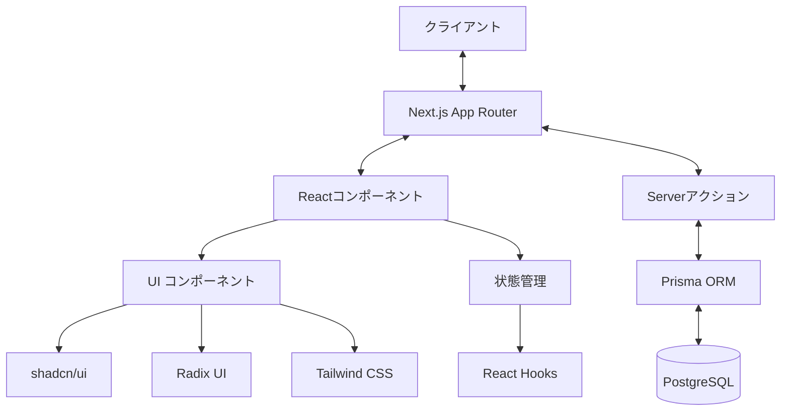
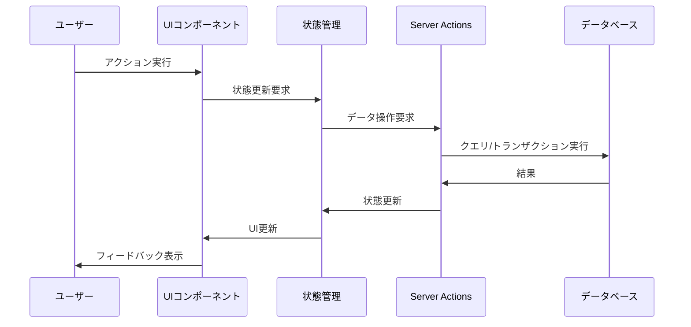

# ローカルイベントカレンダー アーキテクチャ概要

## システムアーキテクチャ

ローカルイベントカレンダーは、Next.jsを用いたフルスタックのウェブアプリケーションとして設計されています。システムアーキテクチャは以下の主要コンポーネントで構成されています。



### コンポーネント説明

1. **クライアント層**
   - ブラウザ上で動作するフロントエンドUIを提供
   - レスポンシブデザインによりデスクトップとモバイルの両方をサポート

2. **プレゼンテーション層**
   - Next.js App Router: ページルーティングとサーバーコンポーネント
   - React コンポーネント: 再利用可能なUI要素
   - UI ライブラリ: shadcn/ui、Radix UI、Tailwind CSSによる一貫したデザイン

3. **ビジネスロジック層**
   - Server Actions: サーバーサイドのデータ操作とビジネスロジック
   - カスタムフック: クライアントサイドの状態管理とロジック

4. **データアクセス層**
   - Prisma ORM: データベースとのインタラクション
   - PostgreSQL: リレーショナルデータベース（計画段階）

5. **外部連携**
   - Google Calendar API: カレンダー連携（計画段階）

## アプリケーション構造

### コンポーネント設計

アプリケーションは以下の主要コンポーネントで構成されています：

#### コアコンポーネント

1. **カレンダービュー**
   - `calendar-view.tsx`: メインのカレンダーコンポーネント
   - `calendar-day-view.tsx`: 日単位のイベント表示
   - `calendar-week-view.tsx`: 週単位のイベント表示

2. **イベント管理**
   - `event-form.tsx`: イベント登録・編集フォーム
   - `event-dialog.tsx`: イベント詳細ダイアログ

3. **UI要素**
   - `category-badge.tsx`: カテゴリーを色分け表示するバッジ
   - `category-filter.tsx`: カテゴリーフィルタリング
   - `header.tsx`: ナビゲーションヘッダー
   - `mobile-nav.tsx`: モバイル向けナビゲーション
   - `site-footer.tsx`: フッターコンポーネント

4. **共通UI**
   - `/components/ui/`: shadcn/uiのベースコンポーネント

### データフロー



### 状態管理

現在のプロジェクトでは、主にReactの組み込みフックを使用したシンプルな状態管理アプローチを採用しています：

- `useState`: ローカルコンポーネント状態
- `useContext`: グローバル状態（必要に応じて）
- カスタムフック: 共通ロジックとUIロジックの分離

### ページルーティング

Next.js App Routerを使用したファイルベースのルーティング構造：

```
app/
├── page.tsx                # ホームページ (/)
└── events/
    └── new/
        └── page.tsx        # イベント登録ページ (/events/new)
```

## 設計原則とポリシー

### アーキテクチャポリシー

1. **サーバーコンポーネント優先**
   - 可能な限りReact Server Componentsを活用
   - 'use client'ディレクティブは、クライアントサイドロジックが必要な場合のみ使用

2. **プログレッシブエンハンスメント**
   - 基本機能はJavaScriptなしでも動作
   - インタラクティブな機能は段階的に強化

3. **コンポーネント設計**
   - 単一責任の原則
   - コンポーネントの再利用性
   - UI・ロジック・状態の適切な分離

### コーディングポリシー

1. **TypeScript厳格モード**
   - 強力な型チェック
   - 明示的な型定義

2. **命名規則**
   - コンポーネント: PascalCase
   - 関数・変数: camelCase
   - ファイル: kebab-case

3. **スタイリング**
   - Tailwind CSS classesでスタイリング
   - デザインシステムとコンポーネントライブラリの一貫性維持

### パフォーマンスポリシー

1. **コード分割**
   - 必要に応じた動的インポート
   - ルートベースの分割

2. **最適化**
   - 画像最適化（Next.js Image）
   - Server Componentsによるペイロード削減

3. **レスポンシブ設計**
   - モバイルファーストアプローチ
   - 複数デバイスへの最適化

## 今後の展開

### 短期計画

- データベース連携の実装（Prisma + PostgreSQL）
- ユーザー認証システムの導入
- API層の拡充

### 中長期計画

- リアルタイム通知機能
- 高度な検索・フィルタリング機能
- Google Calendar APIとの連携
- 多言語対応
- 分析ダッシュボード

## アーキテクチャの課題と解決策

### 現在の課題

1. **モックデータ依存**
   - 解決策: Prisma ORMとデータベース実装の早期導入

2. **認証機能の欠如**
   - 解決策: NextAuth.jsなどの認証ライブラリの導入

3. **テスト戦略**
   - 解決策: Jest、React Testing Library、Playwrightなどのテストフレームワーク導入

### 将来の拡張性

システムは拡張性を考慮して設計されており、以下の方法で拡張可能です：

1. マイクロサービスへの段階的移行
2. サーバーレスアーキテクチャの採用
3. CDN活用による配信最適化
4. キャッシュ戦略の導入 